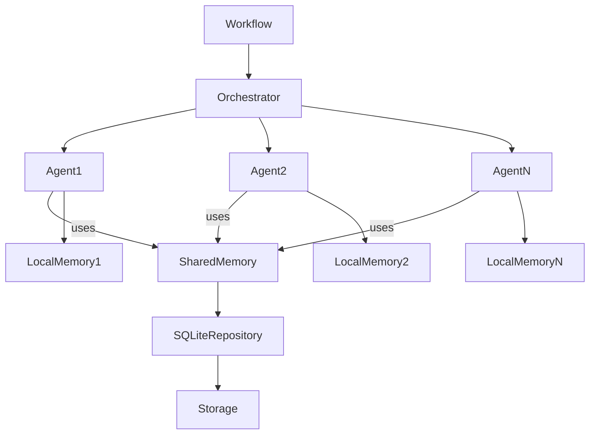

# Multi-Agent Core Engine
## Architecture Document V1

---

## 1. System Vision

The Multi-Agent Core Engine is a sequential workflow execution engine composed of interchangeable agents coordinated by a central Orchestrator with a hybrid memory model.

The system is designed for:

- Future enterprise scalability
- API exposure capability
- Extensibility through agent plugins
- Strict separation of responsibilities

---

## 2. Architectural Principles

1. Clean Architecture
2. Low coupling
3. Fully interchangeable agents
4. Centralized orchestration
5. Controlled hybrid memory
6. Interface independence
7. API-ready design

---

## 3. Execution Model

- Sequential execution (V1)
- Workflows defined by configuration
- Orchestrator controls execution flow
- Agents execute tasks, not governance

Execution flow:

1. Load configuration
2. Build Workflow
3. Orchestrator executes agents in order
4. Agent receives context
5. Agent returns structured result
6. Orchestrator decides next step

---

## 4. Agent Contract

All agents must implement:

class Agent:
    def execute(self, context: AgentContext) -> AgentResult:
        ...

Agents are:

- Stateless by design
- Infrastructure-agnostic
- Restricted to context access
- Non-governing entities

---

## 5. AgentContext

Encapsulates all accessible data for an agent:

- input_data
- controlled shared_memory
- local_memory
- workflow_metadata
- logger
- execution_id

Agents do not access infrastructure directly.

---

## 6. AgentResult

Uniform output structure:

- status (SUCCESS / FAILURE)
- output_data
- emitted_events (optional)
- error_message (optional)
- suggested_next_step (optional)

Interpreted by the Orchestrator.

---

## 7. Memory Model

### Local Memory
- Isolated per agent
- Persisted via repository
- Not directly visible to other agents

### Shared Memory
- Access controlled by Orchestrator
- Designed for future multi-tenant expansion

---

## 8. Workflow

A Workflow is:

- An ordered list of agents
- Defined via configuration
- Business-domain agnostic

The Core executes workflows without domain awareness.

---

## 9. Orchestrator Responsibilities

- Sequential workflow execution
- Shared memory management
- AgentResult interpretation
- Error handling
- Logging control
- Execution lifecycle management

Contains no domain-specific logic.

---

## 10. Layered Structure

core/
  domain/
  application/
  infrastructure/
  interfaces/

- domain: pure entities
- application: orchestration logic
- infrastructure: persistence & config
- interfaces: CLI (temporary), future API

---

## Strategic Decisions

- Sequential execution (V1)
- Interchangeable agents
- Stateless agents
- Hybrid memory model
- Strong orchestrator
- API-ready architecture
- Configurable workflows

---

## 11. System Architecture Diagram

